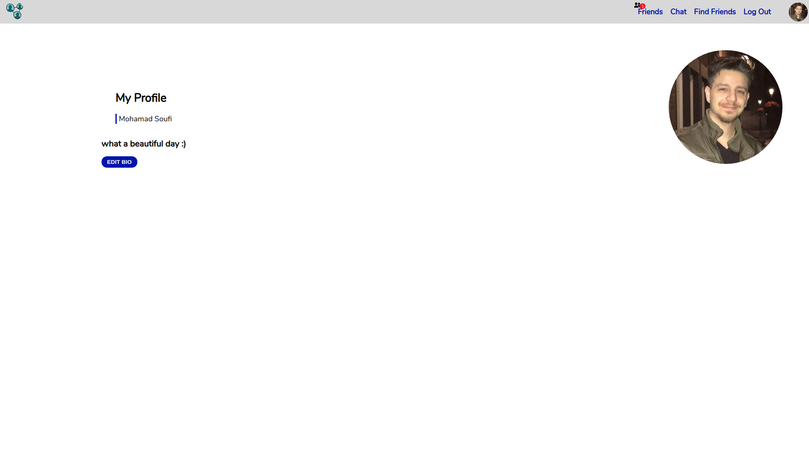
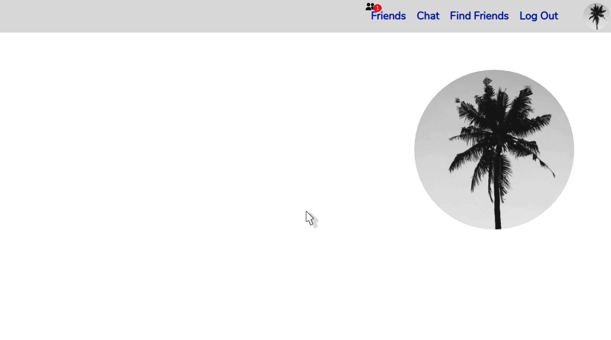
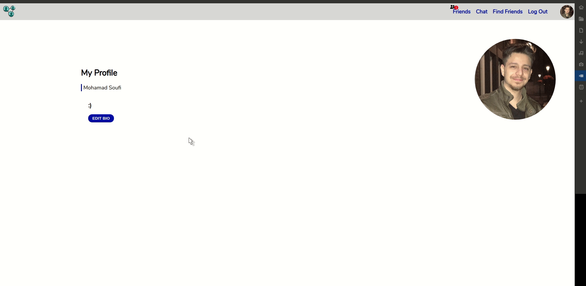
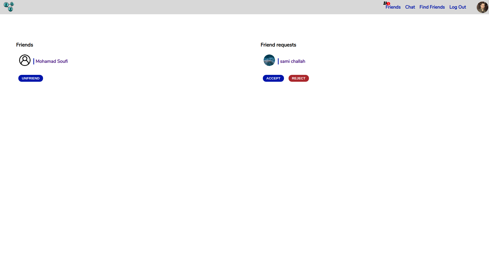
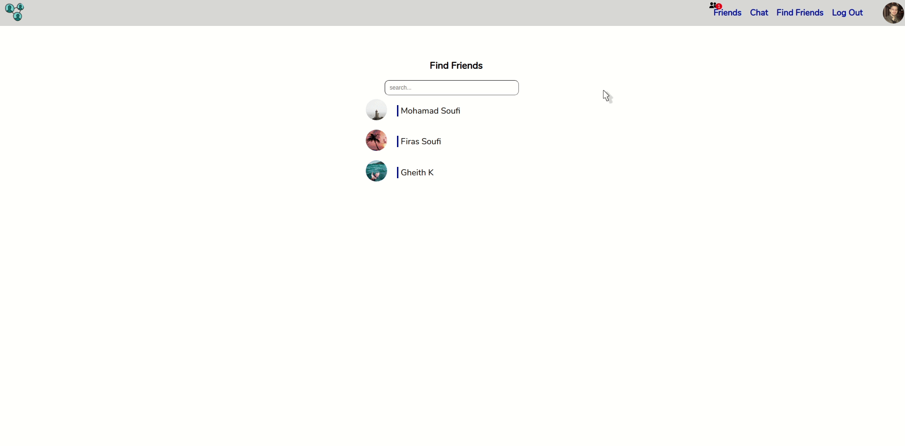
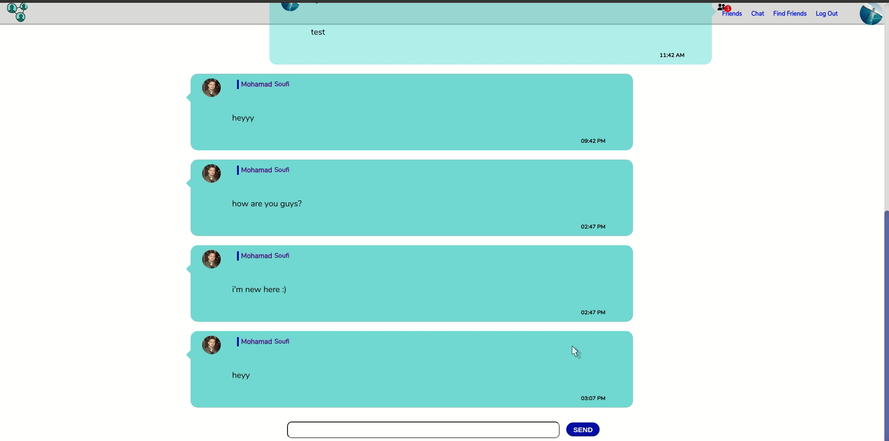

# Social-network

## About the project:

-   The project is a social network where users can create a profile, connect and chat with other users.

#### npm start

Runs the app in the development mode.
Open http://localhost:8080 to view it in the browser.

The page will reload if you make edits.
You will also see any lint errors in the console.

---

## Features:

-   Single page application to enhance the user experience.
-   Users can edit their profile:
    1. add bio.
    2. upload a photo.
-   see and edit their friends list and pending requests.
-   Users can chat in a public chatroom.
-   Users can look up other users using their first name.

## Technologies:

-   React
-   Redux
-   Node.js
-   Express
-   Socket.Io
-   PostgreSQL
-   AWS S3 - hosting photos

## Notes:

1. throughout the project I used Redux as a state manager,class components with local state, functional components with hooks.

2. Public chatroom:

    - messages are instantly received by all users - using Socket.io
    - Messages form the same user are grouped into one block with time stamp.
    - Sending message by clicking or pressing enter.

---

This is the home page where the user can add/change an image and add/ edit the bio.

 

By using AWS S3 and clicking on the profile picture the user can upload a new picture.

 

This is how simple it is to add and change the Bio text.

 

This page shows the Friends list on the left with unfriending option and the friend requests on the right where the user can accept or reject the friend requests.

 

Before typing in the search bar the user can see the last three previous users.

Once the user type the search begins and start seeing the result based on the first name match.

Then it's possible to chose one user to add as friend.

 

In the Chat page users can chat in a public chatroom.

Only the current user's message appears on the right.

 
